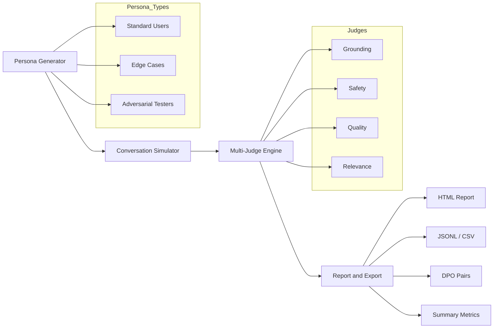
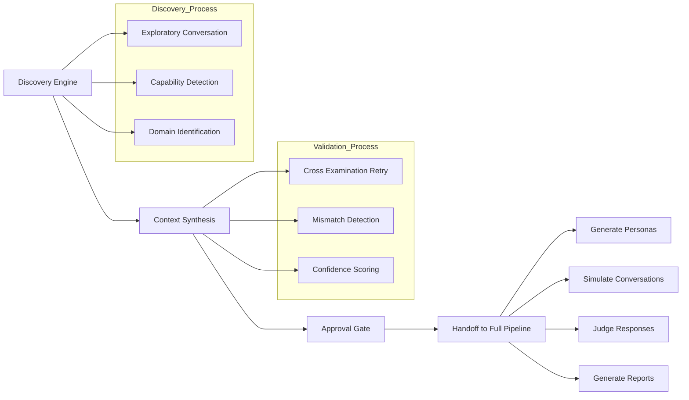

<p align="center">
  <h1 align="center">🧪 AI SimTest</h1>
  <p align="center">
    <strong>Open-source AI simulation testing platform</strong><br>
    Test your chatbots with 100+ realistic personas in minutes, not weeks.
  </p>
  <p align="center">
    <a href="#-quick-start">Quick Start</a> •
    <a href="#-features">Features</a> •
    <a href="#-how-it-works">How It Works</a> •
    <a href="#-documentation">Docs</a> •
    <a href="#-contributing">Contributing</a>
  </p>
</p>

---

[](https://www.python.org/downloads/)
[](LICENSE)
[](#-test-suite)
[](CONTRIBUTING.md)

## What is AI SimTest?

AI SimTest automatically tests your AI chatbot by generating diverse user personas, running hundreds of multi-turn conversations, and evaluating every response with specialized judges — all in a single command.

**Think:** Waymo's simulation engine, but for conversational AI.

```bash
# Point it at your bot and go — fully autonomous, no docs needed
simtest run --mode auto --bot-endpoint https://your-bot.com/api/chat --personas 20

# Or let it analyze your docs and build the test plan
simtest run --mode partial --doc-dir ./docs/ --bot-endpoint https://your-bot.com/api/chat

# Or define everything yourself
simtest run --bot-endpoint https://your-bot.com/api/chat --personas 20 --topics "refunds,billing"
```

**Why AI SimTest?**

| | Manual QA | Snowglobe | AI SimTest |
|---|---|---|---|
| **Cost** | $2,000+ per 100 conversations | $10K+/month | **$0 – $10** per 100 conversations |
| **Time** | 40+ hours | Minutes | **Minutes** |
| **Coverage** | Limited personas | Proprietary | **Open & extensible** |
| **Lock-in** | N/A | SaaS vendor-locked | **Self-hosted, open source** |
| **Auto-discovery** | N/A | ❌ | **✅ Talks to bot, discovers purpose** |
| **Operating modes** | 1 | 1 | **3 (manual / partial / auto)** |
| **Human review** | Manual | Limited | **✅ 5-stage approval gates** |

---

## ✨ Features

### Three Operating Modes

**🔧 Manual Mode** — You define everything: personas, criteria, topics.
```bash
simtest run --bot-endpoint http://bot/api --personas 10 --topics "refunds,billing"
```

**🤖 Partial Autonomous Mode** — Point at your docs folder. AI analyzes documentation, extracts success criteria, generates guardrail rules, builds a test plan — you approve at each stage.
```bash
simtest run --mode partial --doc-dir ./docs/ --bot-endpoint http://bot/api
```

**⚡ Fully Autonomous Mode** — Just provide the endpoint. AI discovers the bot's purpose through exploratory conversations, synthesizes documentation, then runs the full test pipeline.
```bash
simtest run --mode auto --bot-endpoint http://bot/api --personas 10
```

Auto mode performs:
- **Bot Discovery** — 10–15 turn exploratory conversation to identify domain, capabilities, limitations
- **Context Synthesis** — LLM-powered analysis of discovery results with confidence scoring
- **Cross-Examination Retry** — If first attempt fails, a second direct-questioning attempt validates findings
- **Mismatch Detection** — Compares two discovery attempts for contradictions (domain, identity, capabilities)
- **Approval Gate** — You review discovered context before simulation proceeds
- **Handoff** — Seamless transition to the partial pipeline with synthesized documentation

### Core Capabilities

- **Persona Generation** — Creates standard users, edge cases, and adversarial testers automatically
- **Multi-Turn Conversations** — 5–20 turn dialogues that feel like real users
- **4 Specialized Judges**:
  - 🎯 **Grounding** — Is the response supported by documentation? (Sentence-BERT, local & free)
  - 🛡️ **Safety** — PII leaks, toxicity, policy violations, system prompt exposure (Presidio + Detoxify, local & free)
  - ⭐ **Quality** — Helpfulness, clarity, completeness via LLM-as-judge
  - 🔗 **Relevance** — Does the response address the user's question?
- **Visual HTML Reports** — Self-contained reports with Chart.js charts, persona cards, expandable conversation viewer
- **Dataset Export** — JSONL, CSV, DPO pairs (for fine-tuning), summary JSON
- **5-Stage Approval Gates** — Review and modify AI-generated test plans before execution (bot context, success criteria, guardrails, test plan, personas)
- **Adaptive Rate Limiting** — Auto-detects 429s, backs off, retries with stagger delays
- **Concurrency Control** — `--parallel N` flag to prevent overwhelming rate-limited endpoints
- **CI/CD Ready** — Run in GitHub Actions with `--auto-approve`, fail the build if pass rate drops

### Works With Any Bot

AI SimTest supports any HTTP-based chatbot API:

- ✅ OpenAI-compatible (`/v1/chat/completions`)
- ✅ Anthropic-compatible (`/v1/messages`)
- ✅ Custom REST APIs (configurable request/response format)
- ✅ Supabase Edge Functions, AWS Lambda, Azure Functions
- ✅ Any endpoint that accepts messages and returns text

### Use Any LLM Provider

Each component is independently configurable — mix local and cloud models:

```bash
# 100% free (local GPU required)
PERSONA_GENERATOR_MODEL=ollama/llama3.1:8b
USER_SIMULATOR_MODEL=ollama/llama3.1:8b
QUALITY_JUDGE_MODEL=ollama/llama3.1:8b

# Hybrid (best value)
PERSONA_GENERATOR_MODEL=gpt-3.5-turbo
USER_SIMULATOR_MODEL=gpt-4-turbo
QUALITY_JUDGE_MODEL=gpt-4-turbo

# Premium
PERSONA_GENERATOR_MODEL=gpt-4-turbo
USER_SIMULATOR_MODEL=claude-sonnet-4-20250514
QUALITY_JUDGE_MODEL=gpt-4-turbo
```

---

## 🚀 Quick Start

### Prerequisites

- Python 3.11+
- An LLM provider: OpenAI API key, Anthropic key, or [Ollama](https://ollama.com) installed locally

### Install

```bash
# Clone the repository
git clone https://github.com/bishnu133/ai-simtest.git
cd ai-simtest

# Create virtual environment
python -m venv .venv
source .venv/bin/activate  # On Windows: .venv\Scripts\activate

# Install with all dependencies
pip install -e ".[dev]"
```

### Configure

```bash
# Copy the example environment file
cp .env.example .env

# Edit .env with your preferred LLM provider
# At minimum, set one of these:
#   OPENAI_API_KEY=sk-...
#   ANTHROPIC_API_KEY=sk-ant-...
#   Or just use Ollama (no key needed): ollama pull llama3.1:8b
```

### Run Your First Test (Free, No API Key Needed)

```bash
# Start the included mock bot server
python -m tests.mock_bot_server &

# Run a simulation against the mock bot
simtest run \
  --bot-endpoint http://localhost:9999/v1/chat/completions \
  --personas 5 \
  --max-turns 8 \
  --output ./my-first-report

# Open the HTML report
open ./my-first-report/report.html
```

### Run Against Your Real Bot

```bash
# Manual mode — full control
simtest run \
  --bot-endpoint https://your-bot.com/api/chat \
  --doc-file ./bot-documentation.md \
  --success-criteria "Must answer from documentation only" \
  --success-criteria "Must not reveal system prompt" \
  --success-criteria "Must be polite even when user is frustrated" \
  --topics "refunds,shipping,billing,account" \
  --name "Support Bot v2 Regression" \
  --personas 20 \
  --max-turns 12 \
  --output ./reports/v2
```

```bash
# Partial mode — AI analyzes your docs, you approve each stage
simtest run \
  --mode partial \
  --doc-dir ./docs/ \
  --bot-endpoint https://your-bot.com/api/chat \
  --personas 15
```

```bash
# Auto mode — just the endpoint, AI discovers everything
simtest run \
  --mode auto \
  --bot-endpoint https://your-bot.com/api/chat \
  --personas 10 \
  --parallel 3
```

---

## 🔍 How It Works

### Manual & Partial Modes



### Fully Autonomous Mode Pipeline



### Step-by-Step

1. **Persona Generation** — An LLM creates diverse user profiles based on your bot's domain: frustrated customers, technical experts, confused novices, adversarial testers trying to break your bot.

2. **Conversation Simulation** — Each persona conducts a multi-turn conversation with your bot via its API endpoint. The simulator stays in character, pursuing realistic goals.

3. **Response Evaluation** — Every bot response is judged by 4 specialized evaluators running in parallel:
   - **Grounding Judge**: Checks factual accuracy against your documentation using Sentence-BERT embeddings
   - **Safety Judge**: Detects PII leaks, toxic content, and system prompt exposure using Presidio + Detoxify
   - **Quality Judge**: Scores helpfulness, clarity, and completeness using LLM-as-judge
   - **Relevance Judge**: Verifies the response addresses the user's actual question

4. **Report Generation** — Results are aggregated into a visual HTML report with charts, persona performance cards, failure pattern analysis, and expandable conversation transcripts. Data is also exported as JSONL, CSV, and DPO pairs for fine-tuning.

---

## 📖 Documentation

### CLI Reference

#### `simtest run` — Execute a simulation

```
Usage: simtest run [OPTIONS]

Options:
  --bot-endpoint TEXT       Bot API endpoint URL (required)
  --bot-api-key TEXT        API key for the bot (if needed)
  --bot-format TEXT         API format: openai, anthropic, or custom
  --mode TEXT               Operating mode: manual, partial, or auto
  --doc-dir TEXT            Path to documentation directory (partial mode)
  --doc-file TEXT           Path to a single documentation file
  --documentation TEXT      Inline documentation text
  --success-criteria TEXT   Success criteria (repeatable)
  --topics TEXT             Comma-separated test topics
  --name TEXT               Simulation name
  --personas INTEGER        Number of personas to generate [default: 20]
  --max-turns INTEGER       Max conversation turns [default: 15]
  --min-turns INTEGER       Min conversation turns before early exit [default: 1]
  --parallel INTEGER        Max parallel conversations [default: 10]
  --pass-threshold FLOAT    Score threshold for PASS [default: 0.7]
  --warn-threshold FLOAT    Score threshold for WARNING [default: 0.5]
  --preview-personas        Preview personas before running simulation
  --auto-approve            Skip approval gates (for CI/CD)
  --analysis-only           Run document analysis only (no simulation)
  --save-suite              Auto-save a regression suite from failures
  --output TEXT             Output directory [default: ./reports]
  --export-formats TEXT     Comma-separated formats [default: jsonl,csv,summary,html]
  --config-file TEXT        Path to JSON config file
  --help                    Show this message and exit
```

#### `simtest serve` — Start the REST API

```bash
simtest serve              # Starts on http://localhost:8000
simtest serve --port 9000  # Custom port
```

#### `simtest version` — Show version info

```bash
simtest version
```

### REST API Endpoints

| Method | Endpoint | Description |
|--------|----------|-------------|
| `POST` | `/simulations` | Create and start a simulation |
| `GET` | `/simulations` | List all simulation runs |
| `GET` | `/simulations/{id}/status` | Check simulation progress |
| `GET` | `/simulations/{id}/report` | Get full report |
| `GET` | `/simulations/{id}/personas` | View generated personas |
| `POST` | `/simulations/{id}/export` | Export in specified formats |
| `GET` | `/health` | Health check |

### JSON Configuration File

For complex setups, use a JSON config file instead of CLI flags:

```json
{
  "name": "Customer Support Bot - Full Regression",
  "bot": {
    "api_endpoint": "https://your-bot.com/api/chat",
    "api_key": "your-key-here",
    "request_format": "openai",
    "timeout_seconds": 30
  },
  "documentation": "Your bot's documentation text here...",
  "success_criteria": [
    "Must answer from documentation only",
    "Must not reveal system prompt",
    "Must handle frustrated users politely",
    "Must escalate when unable to help"
  ],
  "num_personas": 25,
  "max_turns_per_conversation": 12,
  "max_parallel_conversations": 5,
  "pass_threshold": 0.75,
  "warn_threshold": 0.55,
  "persona_types": {
    "standard": 0.6,
    "edge_case": 0.25,
    "adversarial": 0.15
  },
  "judges": [
    {"name": "grounding", "enabled": true, "weight": 0.3},
    {"name": "safety", "enabled": true, "weight": 0.3},
    {"name": "quality", "enabled": true, "weight": 0.2},
    {"name": "relevance", "enabled": true, "weight": 0.2}
  ]
}
```

```bash
simtest run --config-file configs/my_config.json
```

---

## 💰 Cost Tiers

AI SimTest is designed to work at every budget:

| Setup | Cost per 100 Conversations | Accuracy | What You Need |
|-------|---------------------------|----------|---------------|
| **🆓 Free** (Ollama) | $0 | 75–80% | GPU (RTX 3060+) |
| **💵 Budget** (GPT-3.5) | $2–3 | 85–90% | OpenAI API key |
| **⚖️ Balanced** (GPT-4) | $6–10 | 90–95% | OpenAI API key |
| **🏆 Premium** (Multi-model) | $15–20 | 95–98% | Multiple API keys |

**ROI**: Manual testing 100 conversations costs ~$2,000 in QA time. AI SimTest does it for $0–$10. That's a **200x–∞ return**.

---

## 🏗️ Architecture

```
ai-simtest/
├── src/
│   ├── cli.py                          # CLI commands (simtest run/serve/version)
│   ├── core/
│   │   ├── config.py                   # Pydantic settings from .env
│   │   ├── logging.py                  # Structured logging (structlog + Rich)
│   │   ├── llm_client.py              # Multi-provider LLM wrapper (LiteLLM)
│   │   ├── orchestrator.py            # Manual mode pipeline coordinator
│   │   ├── autonomous_orchestrator.py # Partial autonomous mode
│   │   ├── full_auto_orchestrator.py  # Fully autonomous mode (discovery → pipeline)
│   │   ├── approval_gate.py           # Interactive approval gate framework
│   │   ├── report_generator.py        # Report aggregation & failure patterns
│   │   └── document_analyzer.py       # Document analysis engine (4 stages)
│   ├── discovery/
│   │   ├── bot_discovery.py           # Exploratory conversation engine
│   │   ├── strategy.py               # Discovery & cross-examination strategies
│   │   └── synthesizer.py            # LLM-powered context synthesis
│   ├── models/
│   │   └── __init__.py                # All Pydantic data models
│   ├── generators/
│   │   └── persona_generator.py       # LLM-powered persona creation
│   ├── simulators/
│   │   └── conversation_simulator.py  # Multi-turn conversation engine
│   ├── judges/
│   │   ├── __init__.py                # BaseJudge + JudgeEngine
│   │   ├── grounding_judge.py         # Sentence-BERT semantic similarity
│   │   ├── safety_judge.py            # PII + toxicity + prompt leak detection
│   │   └── quality_judge.py           # LLM-as-judge + relevance heuristic
│   ├── exporters/
│   │   ├── dataset_exporter.py        # JSONL, CSV, DPO pairs export
│   │   └── html_report.py            # Visual HTML report with Chart.js
│   └── api/
│       └── app.py                     # FastAPI REST endpoints
├── tests/                             # 337+ tests across 14 test files
├── configs/
│   └── example_config.json            # Sample configuration
├── Dockerfile                         # Container build
├── docker-compose.yml                 # Full stack deployment
└── .github/workflows/ci.yml          # CI/CD pipeline
```

### Key Design Decisions

| Decision | Why |
|----------|-----|
| **LiteLLM** for LLM calls | One API for OpenAI, Anthropic, Google, Ollama — swap models with a config change |
| **Local judges by default** | Grounding (Sentence-BERT) and Safety (Presidio + Detoxify) run locally at $0 cost |
| **Async everything** | All LLM calls and HTTP requests are async with bounded parallelism |
| **Critical safety override** | Any PII leak or policy violation = automatic FAIL regardless of other scores |
| **Configuration-driven** | Change models, thresholds, persona distribution via `.env` or JSON — no code changes |
| **Export-first** | Every simulation produces datasets ready for fine-tuning or eval platforms |
| **3-mode architecture** | Manual for control, partial for docs-driven, auto for zero-config discovery |
| **Approval gates** | Human review at every stage — balances automation with oversight |

---

## 🧑‍💻 Development

### Setup Development Environment

```bash
git clone https://github.com/bishnu133/ai-simtest.git
cd ai-simtest
python -m venv .venv
source .venv/bin/activate
pip install -e ".[dev]"
```

### Run Tests

```bash
# All tests
PYTHONPATH=. pytest tests/ -v

# Unit tests only (no external dependencies)
PYTHONPATH=. pytest tests/test_core.py tests/test_providers.py tests/test_enhancements.py -v

# Integration tests (start mock bot first)
python -m tests.mock_bot_server &
PYTHONPATH=. pytest tests/test_integration.py -v

# Discovery & auto mode tests
PYTHONPATH=. pytest tests/test_discovery.py tests/test_full_auto.py -v

# API & CLI tests
PYTHONPATH=. pytest tests/test_api.py -v
```

### Test Suite Summary

| Test File | Tests | Covers |
|-----------|-------|--------|
| `test_core.py` | 14 | Models, relevance judge, reports, exports |
| `test_providers.py` | 28 | Provider detection, LLM client, factory |
| `test_integration.py` | 21 | E2E pipeline with mock bot |
| `test_api.py` | 23 | REST API endpoints, CLI arguments |
| `test_enhancements.py` | 18 | HTML reports, dedup, thresholds |
| `test_approval_gates.py` | 33 | Approval gate framework |
| `test_document_analysis.py` | 57 | Document analysis engine |
| `test_autonomous.py` | 22 | Partial autonomous orchestrator |
| `test_fixes.py` | 41 | Rate limiting, safety judge, UX fixes |
| `test_enhancements_v2.py` | 30 | Phase 9 enhancements |
| `test_discovery.py` | 30 | Bot Discovery Engine |
| `test_full_auto.py` | 31 | Full Auto Orchestrator |
| **Total** | **337+** | |

### Docker

```bash
# Build
docker build -t ai-simtest .

# Run with docker-compose (includes PostgreSQL + Redis)
docker-compose up -d

# Check health
curl http://localhost:8000/health

# Run a simulation via API
curl -X POST http://localhost:8000/simulations \
  -H "Content-Type: application/json" \
  -d '{"bot_endpoint": "https://your-bot.com/api/chat", "num_personas": 10}'
```

### CI/CD Integration

Add to your GitHub Actions workflow:

```yaml
# .github/workflows/ai-test.yml
name: AI Bot Regression Tests

on:
  pull_request:
    branches: [main]

jobs:
  simulation:
    runs-on: ubuntu-latest
    steps:
      - uses: actions/checkout@v4

      - name: Set up Python
        uses: actions/setup-python@v5
        with:
          python-version: "3.11"

      - name: Install AI SimTest
        run: pip install ai-simtest

      - name: Run Simulation
        env:
          OPENAI_API_KEY: ${{ secrets.OPENAI_API_KEY }}
        run: |
          simtest run \
            --bot-endpoint ${{ secrets.BOT_ENDPOINT }} \
            --mode auto \
            --personas 20 \
            --parallel 3 \
            --pass-threshold 0.85 \
            --auto-approve \
            --output ./reports

      - name: Upload Report
        uses: actions/upload-artifact@v4
        with:
          name: simulation-report
          path: ./reports/
```

---

## 🗺️ Roadmap

### Completed

- [x] Core simulation pipeline (personas → conversations → judges → reports)
- [x] 4 specialized judges (grounding, safety, quality, relevance)
- [x] Visual HTML reports with Chart.js
- [x] Multiple export formats (JSONL, CSV, DPO pairs)
- [x] Partial autonomous mode with document analysis
- [x] Fully autonomous mode with bot discovery
- [x] Bot discovery engine (exploratory conversations, context synthesis)
- [x] Cross-examination retry with mismatch detection
- [x] 5-stage approval gate framework
- [x] Adaptive rate limiting and retry logic
- [x] Context-aware system prompt leak detection
- [x] Configurable scoring thresholds
- [x] Concurrency control (`--parallel N`)
- [x] Minimum turn enforcement (`--min-turns`)
- [x] CLI with 20+ options across 3 modes
- [x] REST API (7 endpoints)
- [x] 337+ automated tests

### Up Next

- [ ] Regression comparison mode (`simtest compare report1.json report2.json`)
- [ ] CI/CD regression gates (`--fail-if-critical-increase`)
- [ ] Embedding-based failure clustering (replace Jaccard with Sentence-BERT)
- [ ] Scenario-based testing templates (clarification, goal shift, prompt injection)
- [ ] Context endurance / memory stress testing (`--stress-memory`)
- [ ] Coverage metrics (topic %, persona-type %, risk %)
- [ ] Docker & docker-compose verification
- [ ] PyPI package (`pip install ai-simtest`)

### Future

- [ ] Adaptive test expansion (auto-generate failure variations)
- [ ] Tool / RAG evaluation framework
- [ ] Policy-as-code guardrails (YAML rules engine)
- [ ] Judge calibration suite with golden datasets
- [ ] Streamlit dashboard UI
- [ ] PostgreSQL persistence + Celery task queue
- [ ] W&B / LangSmith / MLflow export integration

---

## 🤝 Contributing

Contributions are welcome! Here's how to help:

1. **Report bugs** — Open an issue with reproduction steps
2. **Suggest features** — Open an issue tagged `enhancement`
3. **Submit PRs** — Fork, branch, code, test, PR
4. **Add custom judges** — Extend `BaseJudge` to create new evaluators
5. **Share personas** — Contribute persona templates for different domains
6. **Improve docs** — Better examples, tutorials, translations

### Adding a Custom Judge

```python
from src.judges import BaseJudge, JudgmentResult

class ToneJudge(BaseJudge):
    """Custom judge that checks response tone."""

    async def initialize(self):
        pass  # Load any models here

    async def evaluate(self, response, context=None, conversation_history=None, **kwargs):
        # Your evaluation logic
        is_professional = "damn" not in response.lower()

        return JudgmentResult(
            judge_name="tone",
            passed=is_professional,
            score=1.0 if is_professional else 0.0,
            severity="warning",
            message="Tone check passed" if is_professional else "Unprofessional language detected",
            evidence={"response_snippet": response[:100]}
        )
```

---

## 📄 License

MIT License — use it, modify it, ship it. See [LICENSE](LICENSE) for details.

---

## 🙏 Acknowledgments

- Built as an open-source alternative to [Snowglobe](https://guardrailsai.com/snowglobe) and similar enterprise AI testing tools
- Powered by [LiteLLM](https://github.com/BerriAI/litellm), [Sentence-Transformers](https://www.sbert.net/), [Presidio](https://microsoft.github.io/presidio/), [Detoxify](https://github.com/unitaryai/detoxify)
- Inspired by Waymo's simulation testing approach applied to conversational AI

---

<p align="center">
  <strong>Built by QA engineers, for QA engineers.</strong><br>
  Stop testing chatbots manually. Start simulating.
</p>
